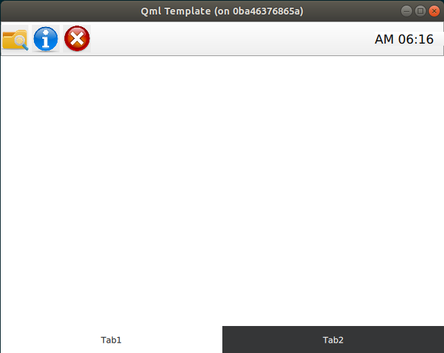
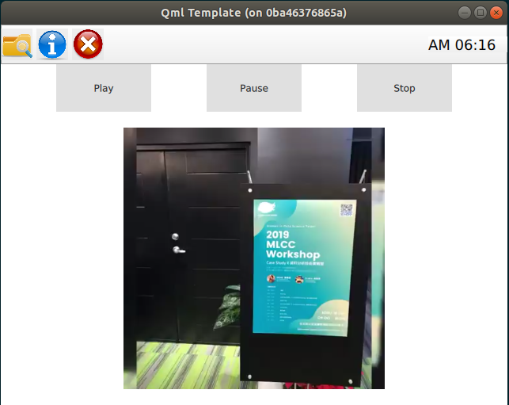

# Qt Template/Example

This is `template/example` that can rapid to build ```Qt/QML``` application.

You can just copy you prefer program language's folder and start to code and build and run.

Applications that build with this `Qt Template`: [Examples](#examples)

## Usage

1. Clone this repo
```bash
$ git clone https://github.com/kaka-lin/qt-template.git
```

2. Choosing you prefer program language, ex: ```c++```

```bash
$ cp -r c++/qml <Your path>
```

3. Buinding application

    Follow the steps of each folder's ```README```

## Run with Docker (Optional)

Please see the document at [docker folder](docker/README.md)

## Templates

### QML Template




### QML/QMultimedia Template



## Examples

Applications that build with `Qt`, you can reference projects as below,

- Qt5/QML
    - [Network Configuration Tool](https://github.com/kaka-lin/network-configuration-tool)

- PyQt5

    - [serialport-gui](https://github.com/kaka-lin/serialport-gui)

        UART and ModBus

    - [pyqt-image-recognition](https://github.com/kaka-lin/pyqt-image-recognition)

        Handwriting recognition

    - [cvs-ptool](https://github.com/kaka-lin/csv-ptool)

        Embedding `Matplotlib` in Qt

    - [audio-tools](https://github.com/kaka-lin/audio-tools)

        Embedding `Matplotlib` in Qt

- PyQt5/QML

    - [pytest-gui](https://github.com/kaka-lin/pytest-gui)

        Can see the result of unittest on GUI immediately.

    - [canbus-tool](https://github.com/kaka-lin/canbus-tool)

        Can dump canbus information
