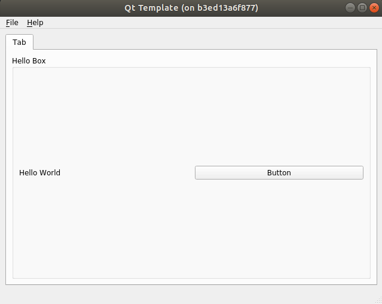

# Qt Template/Example

This is `template/example` that can rapid to build ```Qt/QML``` application.

You can just copy you prefer program language's folder and start to code and build and run.

Applications that build with this `Qt Template`: [Examples](#examples)

## Usage

1. Clone this repo

    ```bash
    $ git clone https://github.com/kaka-lin/qt-template.git
    ```

2. Choosing you prefer program language, ex: ```c++```

    ```bash
    $ cp -r c++/qml <Your path>
    ```

3. Buinding application

    Follow the steps of each folder's ```README```

## Running and showing the Templates

### 1. Run with Docker (Recommend)

You can use the docker image that we already build, as below

```bash
$ docker pull kakalin/qt:5.12.0
```

Or you can build it from scratch, please check the document in the [docker folder](docker/README.md).

And then running with docker:

```bash
$ ./docker-run.sh
```

### 2. Run with local Qt

Please install Qt/QML on your local machine.

### 3. Run the template

Chose the version that you want to use.

##### QML

```sh
$ cd python/pyqt5/qml
$ python3 qml_template.py
```


##### QT

```sh
$ cd python/pyqt5/qt
$ python3 main.py
```



## Examples

Applications that build with `Qt`, you can reference projects as below,

- Qt5/QML
    - [YUV Player](https://github.com/kaka-lin/YUVPlayer)
    - [Qt Video Player](https://github.com/kaka-lin/qt-video-player)
    - [Network Configuration Tool](https://github.com/kaka-lin/network-configuration-tool)

- PyQt5

    - [serialport-gui](https://github.com/kaka-lin/serialport-gui)

        UART and ModBus

    - [pyqt-image-recognition](https://github.com/kaka-lin/pyqt-image-recognition)

        Handwriting recognition

    - [cvs-ptool](https://github.com/kaka-lin/csv-ptool)

        Embedding `Matplotlib` in Qt

    - [audio-analysis-tools](https://github.com/kaka-lin/audio-analysis-tools)

        Embedding `Matplotlib` in Qt

- PyQt5/QML

    - [pytest-gui](https://github.com/kaka-lin/pytest-gui)

        Can see the result of unittest on GUI immediately.

    - [canbus-tool](https://github.com/kaka-lin/canbus-tool)

        Can dump canbus information
