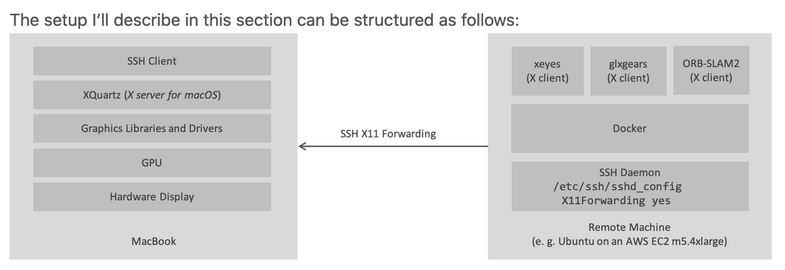

# The GUIDE of Qt Container Image

This file is about all the issues of running  qt environments of docker.

> Running the GUI application in a Docker container:
> - on the local machine
> - on a remote machine via SSH.

## Guides

We divided into the following parts.

- Host: macOS, container: macOS (local machine)
- Host: macOS, conrainer: Linux without GPU (remote)
- Host: macOS, conrainer: Linux with GPU (remote)
- Host: Linux without GPU, container: Linux without GPU
- Host: Linux without GPU, container: Linux with GPU
- Host: Linux with GPU, container: Linux without GPU
- Host: Linux with GPU, container: Linux with GPU

### 1. xhost 開啟權限

- container on local machine

  - macOS: `xhost +localhost`
  - Linux: `xhost +local:docker`

- container on remote machine: `xhost +`

### 2. X11 Authentication



使用 X11 Forwarding 時，會隨機產生一個授權的 cookie，存放在 SSH Server (就是 remote machine / X11 Client, 如上圖所示) 的 `~/.Xauthority` 文件夾中。這個 cookie 會在每次 X11 Clinet 發送數據時用到。

當我們使用了 `--network=host` 參數後，容器中的 X11 Clinet (X Application) 將直接通過 `TCP/IP` 與外部通訊。然而容器內並沒有這個授權文件，因此我們需要將它 mount 進容器內，如下:

```
-v $HOME/.Xauthority:$HOME/.Xauthority
```

### 3. OpenGL issues related (尚待解決)

#### Host: macOS

只要 Host machine 為 macOS 且 container image 跑在 Ubuntu server 上，不管 server 是否有 GPU, 都需使用 `QT_QUICK_BACKEND=software`，否則會發生 error: `Buffer creation failed`, 如下:

```sh
Buffer creation failed
QOpenGLShaderProgram: could not create shader program
QOpenGLShader: could not create shader
QOpenGLShader: could not create shader
shader compilation failed:
""
QOpenGLShaderProgram::uniformLocation(matrix): shader program is not linked
QOpenGLShaderProgram::uniformLocation(opacity): shader program is not linked
QOpenGLShaderProgram: could not create shader program
QOpenGLShader: could not create shader
QOpenGLShader: could not create shader
shader compilation failed:
""
...
qt.qpa.xcb: QXcbConnection: XCB error: 167 (Unknown), sequence: 484, resource id: 0, major code: 149 (Unknown), minor code: 1
qt.glx: qglx_findConfig: Failed to finding matching FBConfig (8 8 8 8)
qt.glx: qglx_findConfig: Failed to finding matching FBConfig (1 8 8 8)
qt.glx: qglx_findConfig: Failed to finding matching FBConfig (1 1 8 8)
qt.glx: qglx_findConfig: Failed to finding matching FBConfig (1 1 1 8)
qt.glx: qglx_findConfig: Failed to finding matching FBConfig (1 1 1 8)
qt.glx: qglx_findConfig: Failed to finding matching FBConfig (1 1 1 8)
qt.glx: qglx_findConfig: Failed to finding matching FBConfig (1 1 1 8)
qt.glx: qglx_findConfig: Failed to finding matching FBConfig (1 1 1 8)
```
